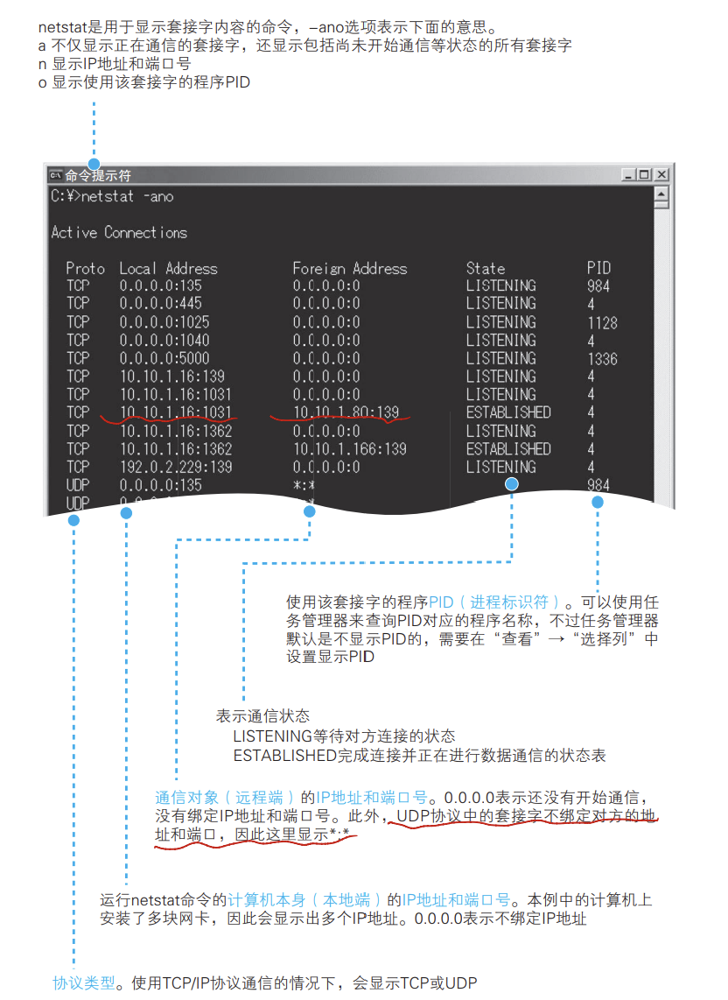

> 本章主要介绍**协议栈**如何处理数据收发请求的内容
> 协议栈指的是网络传输过程中，各个协议共同配合完成这个过程的从上到下 栈 的结构

## 1. 创建套接字

### 1.1 协议栈的内部结构

- 应用层程序会将收发数据的操作委派到下层部分（操作系统的协议栈，电脑的硬件等等）来完成
- 最上层是**Socket库**中包含**解析器**，用来向DNS服务器发送查询请求以获得域名对应的IP地址
- 下面的TCP / UDP都会执行上面应用层委托下来的数据收发任务

  > TCP:  浏览器， 邮件等一般的应用程序收发操作使用该协议
  >
  > UDP: DNS等收发数据 *较短* 的情况
-  IP协议负责将网络包发送给通信对象

  > ICMP(网络控制报文协议)：告知网络传输中的各种错误信息
  >
  > ARP（地址解析协议）：用IP地址查找MAC地址
- 网卡驱动：负责控制网卡硬件
- 网卡：负责实际的收发操作

### 1.2 套接字的实体就是通信控制信息
- 协议栈中包含套接字，套接字是网络进行连接的基础和起点，套接字是一个抽象概念，它的实体是一块内存地址（控制信息）
 > 控制信息：下一步要进行的操作（也就是说，*协议栈是根据套接字中记录的控制信息来工作的*）
 > IP地址
 > 端口号等
 > 

- Windows中关于套接字的命令

``netstat -ano``
	- a 显示所有套接字
	- n 显示IP和端口号
	- o 显示进程号
	

## 2. 连接服务器

## 3收发数据

##  4. 从服务器断开连接，删除套接字

## 5. IP，以太网的包收发操作

##  6.UDP协议收发数据的操作

